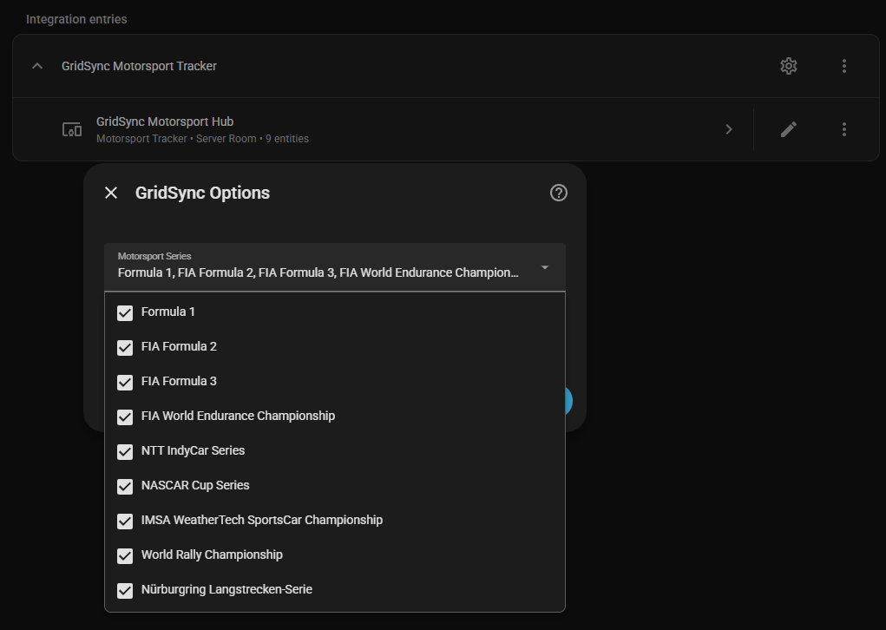
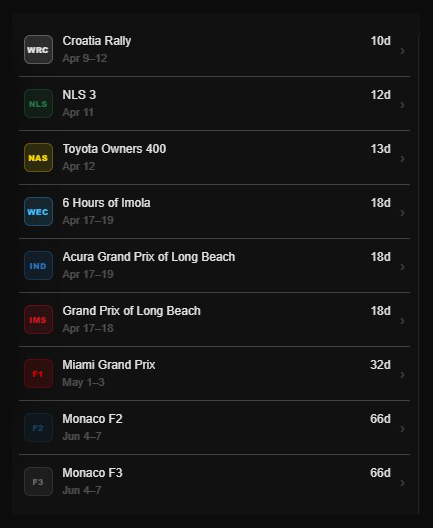
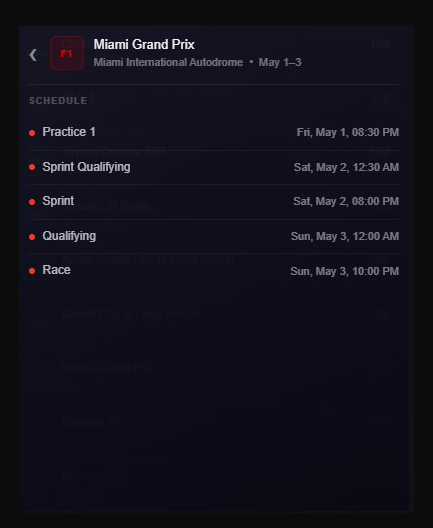
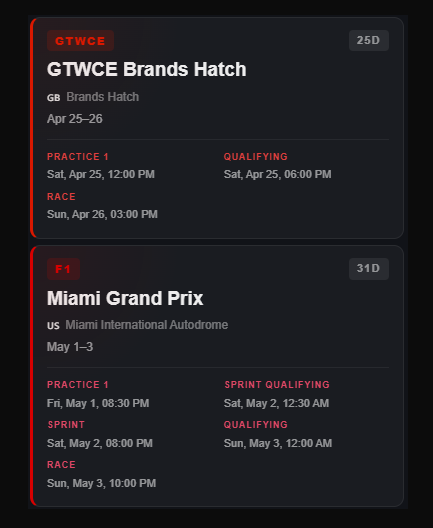
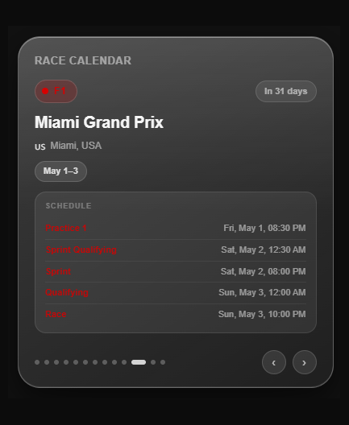

# GridSync — Motorsport Tracker for Home Assistant

[](https://hacs.xyz)
[](https://www.home-assistant.io)
[](LICENSE)

A Home Assistant integration that tracks upcoming motorsport events across 13 series with a companion Lovelace card suite — compact list, iOS-style glass widget, and a full schedule card.

---

## Features

- 🏎️ **13 series** — F1, F2, F3, WEC, IndyCar, NASCAR, IMSA, WRC, NLS, Supercars, BTCC, GTWCE, ELMS
- 📅 **One sensor per series** — next event, track, location, dates, full session schedule
- ⏱️ **Live session detection** — pulsing LIVE badge with 90-minute session windows
- 🔢 **Days filter** — hide events beyond a configurable number of days
- 🌍 **Local time** — all session times shown in your browser timezone
- 🃏 **3 Lovelace cards** — list card, iOS glass card, full schedule card
- ♻️ **Smart refresh** — hourly coordinator update, 10-second client-side timer
- 🔇 **Zero database load** — sensors excluded from HA recorder

---

## Screenshots

### Integration Setup


### Cards

**Race Calendar List** | **Race Calendar Detail**
:---:|:---:
 | 

**Full Schedule Card** | **iOS Glass Card**
:---:|:---:
 | 

---

## Installation

1. Copy `gridsync/` into `/config/custom_components/`
2. Restart Home Assistant
3. Create a `gridsync` folder in `/config/www/`
4. Copy the card files from `www/gridsync/` into `/config/www/gridsync/`
5. Register resources (see Card Installation below)

---

## Integration Setup

**Settings → Integrations → + Add Integration → GridSync Motorsport Tracker**

- Select the series you want to track
- Set a days filter (0 = show all, 30 = only events within 30 days)

To change your selection later: **Settings → Integrations → GridSync → ⚙️ Configure**

---

## Card Installation

Add each card you want to use as a Lovelace resource:

**Settings → Dashboards → ⋮ → Resources → + Add Resource**

| Card | File | URL |
|------|------|-----|
| List Card | `gridsync-list-card.js` | `/local/gridsync/gridsync-list-card.js` |
| iOS Card | `gridsync-ios-card.js` | `/local/gridsync/gridsync-ios-card.js` |
| Schedule Card | `gridsync-card.js` | `/local/gridsync/gridsync-card.js` |

Type: **JavaScript module** for all three. Hard refresh your browser after adding (**Ctrl+Shift+R**).

---

## Cards

### 1. List Card — `gridsync-list-card`

Compact scrollable list sorted by time to next session. Tap any row to open a slide-in detail panel with the full session schedule.

```yaml
type: custom:gridsync-list-card
```

**Features:**
- Sorted by closest upcoming session
- Live session detection with countdown between sessions
- Slide-in detail panel with complete schedule
- Past sessions marked as Complete, live session with pulsing dot
- Minimum height 380px built-in

---

### 2. iOS Glass Card — `gridsync-ios-card`

Apple-style liquid glass widget. One series at a time, navigate with arrows or dots.

```yaml
type: custom:gridsync-ios-card
title: Race Calendar
```

**Features:**
- Liquid glass design with blur and shine effects
- All sessions shown, past ones faded
- Navigation arrows and dot indicators
- Fixed height 435px — no layout shifts
- Sorted by closest upcoming session

---

### 3. Full Schedule Card — `gridsync-card`

Vertical list showing all selected series with complete session schedules expanded.

```yaml
type: custom:gridsync-card
title: Motorsport Schedule
```

**Features:**
- All sessions shown — past faded, future full opacity
- Full session names (Practice 1, Sprint Qualifying, etc.)
- Sorted by closest upcoming session
- Live indicator with pulsing dot

---

## Sensors

One sensor per selected series, e.g. `sensor.gridsync_formula_1`

### Sensor Attributes

| Attribute | Description |
|-----------|-------------|
| `series_name` | Full series name |
| `series_short` | Short label e.g. `F1` |
| `series_color` | Brand hex color |
| `series_logo` | Logo filename |
| `event_name` | Full event name |
| `track_name` | Circuit name |
| `location` | City, Country |
| `flag` | Country flag emoji |
| `round` | Round number |
| `start_date` | Event start `YYYY-MM-DD` |
| `end_date` | Event end `YYYY-MM-DD` |
| `sessions` | Dict of session name → UTC ISO datetime |
| `days_until` | Days until event starts (0 = this weekend) |
| `next_session` | Name of next upcoming session |
| `next_session_time` | ISO datetime of next session |

---

## Card Behaviour

| State | List card | Detail panel |
|-------|-----------|--------------|
| Upcoming | Days until event | Full session schedule |
| Active weekend | Next session + countdown | Sessions with times |
| Live session | LIVE · Session name (red) | LIVE badge + pulsing dot |
| Between sessions | Countdown to next (e.g. `1h 30m`) | Sessions, past = Complete |
| Weekend complete | Complete | All sessions Complete |
| After midnight | Next event loaded | — |

---

## Supported Series

| Key | Series | Color |
|-----|--------|-------|
| `f1` | Formula 1 | `#E10600` |
| `f2` | FIA Formula 2 | `#004267` |
| `f3` | FIA Formula 3 | `#676767` |
| `wec` | FIA World Endurance Championship | `#00B9FF` |
| `indycar` | NTT IndyCar Series | `#0072BC` |
| `nascar` | NASCAR Cup Series | `#FFD700` |
| `imsa` | IMSA WeatherTech SportsCar Championship | `#E51B24` |
| `wrc` | World Rally Championship | `#FFFFFF` |
| `nls` | Nürburgring Langstrecken-Serie | `#067748` |
| `supercars` | Supercars Championship | `#EE3123` |
| `btcc` | British Touring Car Championship | `#020255` |
| `gtwce` | GT World Challenge Europe | `#E31E12` |
| `elms` | European Le Mans Series | `#FF5F00` |

---

## Updating the Schedule

The calendar lives in `custom_components/gridsync/motorsport_schedule.json`. To update:

1. Edit the JSON — add/remove events, fix session times
2. **Settings → Integrations → GridSync → ⋮ → Reload** — no restart needed

All session times must be in **UTC**.

### JSON Structure

```json
{
  "version": "2026.2.0",
  "last_updated": "2026-03-27",
  "series": {
    "f1": {
      "name": "Formula 1",
      "short_name": "F1",
      "logo": "f1.png",
      "color": "#E10600",
      "events": [
        {
          "round": 3,
          "name": "Japanese Grand Prix",
          "track": "Suzuka International Racing Course",
          "location": "Suzuka, Japan",
          "flag": "🇯🇵",
          "start_date": "2026-03-27",
          "end_date": "2026-03-29",
          "sessions": {
            "practice1": "2026-03-27T02:30:00Z",
            "practice2": "2026-03-27T06:00:00Z",
            "practice3": "2026-03-28T02:30:00Z",
            "qualifying": "2026-03-28T06:00:00Z",
            "race": "2026-03-29T05:00:00Z"
          }
        }
      ]
    }
  }
}
```

---

## Automation Examples

### Notify Before a Race Weekend

```yaml
automation:
  - alias: "F1 Race Weekend Alert"
    trigger:
      - platform: template
        value_template: >
          {{ state_attr('sensor.gridsync_formula_1', 'days_until') == 1 }}
    action:
      - service: notify.mobile_app
        data:
          title: "🏎️ F1 This Weekend!"
          message: >
            {{ state_attr('sensor.gridsync_formula_1', 'event_name') }}
            at {{ state_attr('sensor.gridsync_formula_1', 'track_name') }}
```

---

## Pending

- [ ] Remote schedule updates — fetch `motorsport_schedule.json` from a hosted URL so calendars update automatically without touching the integration. Planned: GitHub-hosted JSON with hourly fetch and local file fallback for offline use.
- [ ] Improve session end time accuracy 
- [ ] Series logos

---

## License

MIT — see [LICENSE](LICENSE) for details.

---

## Contributing

Pull requests welcome. To add a new series:
1. Add it to `AVAILABLE_SERIES` and `SERIES_COLORS` in `const.py`
2. Add its events to `motorsport_schedule.json`
3. Add its color to `LIST_SERIES_META` in each card JS file
